# Specification: Daily Information App
Form and Behavior Specification

## Table of Contents

1. [Design Overview](#overview)
2. [Interaction Detail](#interaction-detail)
3. [Data Modeling](#data-modeling)
4. [MVP Outcome](#results) (Skip docs to take a look at the MVP)

## 1. Overview

This document describes a browser-based “app” for an instructor to enter in daily metrics to track school activity and monitor school growth. At the end of each day, a designated instructor for each school can enter this daily information to keep track of: attendance, prospective students (information), new students, new courses (e.g. MLT Training such as championships, iron hand, week long seminar, week end seminar, etc.), tests, drops, etc. By entering this data for each school on a daily basis, the instructors within the school can monitor school growth. With each school’s information up to date, a Regional instructor can monitor regional growth, and a higher belts can observe general school functions nationally.

### 1.1. Terminology

Information - the school term for prospective student. As used herein, it means someone who has reached out to the school to learn about training. It is differentiated from a Lead. Leads are not tracked in this system, since it will make more sense to keep leads in a mail-list type system such as intercom.io or mailchimp.

Event - for the purposes of this document, the term event pertains to an activity that occurs within the school that warrants data capture. In phase 1, the events include: information, new student, new course, test, drop

DataStudio - Google’s tool for graphing data, and developing custom reports which can be shared to specific users. (https://datastudio.google.com)

### 1.2. Desired Outcome

By having instructors capture standardized metrics for every school, all stakeholders will be better informed regarding school health and growth. School-level instructors can better monitor student attendance achievement, regional instructors can monitor growth of the region and the schools within it, and look for both positive and negative trends to balance, and Oom Yung Doe can better see how things are progressing Nationally and beyond, over time.
1.3. Supporting Artifacts
The following artifacts can be used as reference to this document. 

The following is a video animatic of the general functionality on the data input side. https://youtu.be/UQoq28DLjg8

More to come with respect to database table structures and data visualization

## 2. Interaction Detail
This section describes specific interactions.

### 2.1. Instructor Experience

#### Login
For the phase described within this document, only a designated instructors need access to the web app for data entry. Other instructors could see reports via Google Data Studio directly. 

Each school would designate an instructor or team of instructors responsible for making sure that daily information was entered into the system. An instructor on this team would log into the app via a web browser. It would be possible to log in via a phone, but much more convenient to use a device with a keyboard and larger monitor.

The instructor would go to the app URL (TBD) and enter their credentials in the form of an email and a password. We can add an reset password feature, but this may not be necessary in Version 1 - we can manually reset passwords if needed. 

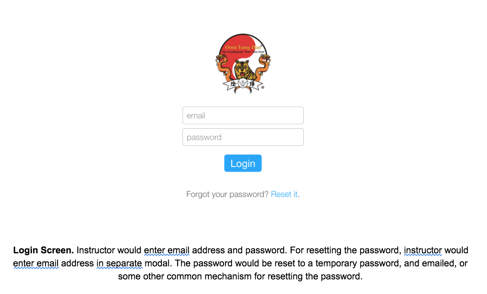

#### Navigation Menu
In the first iteration of the app, we may not need a navigation menu of any significance, since we will only initially have one function - the daily information entry. However, in the mock-ups, a nav is provided using a standardized nav slide out.

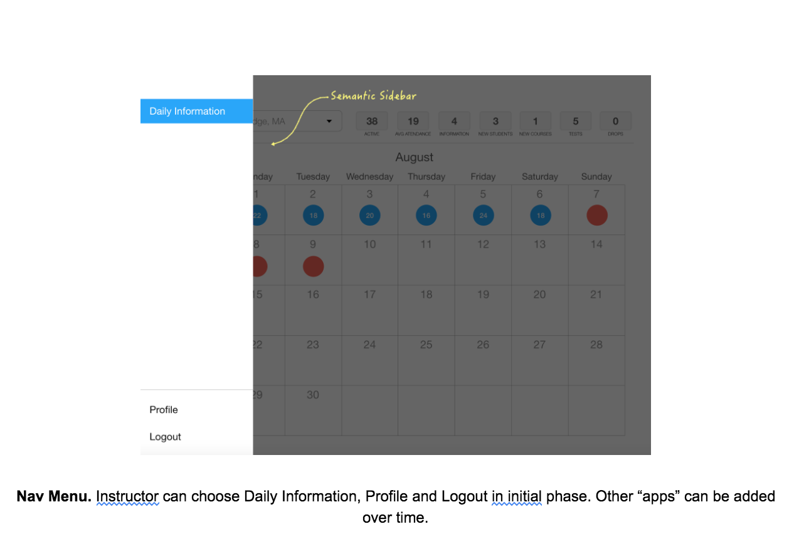

#### Calendar View
The intent of the calendar view is to give a visual to each school’s data tracker (or tracking team) an indication of data being entered, or as important, lack of data being entered. By showing the view as a calendar, the emphasis is on recording the appropriate school data events every day.

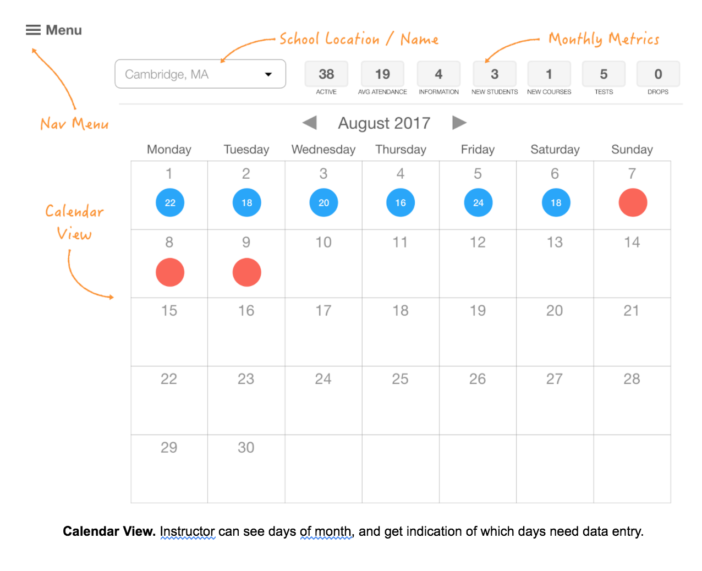

Key aspects of the Calendar View
1. Navigation to sidebar menu, for other functionality in the future, as well as basics such as profile, log out.
2. School location indication AND / OR navigation. Most users who log in will likely have access to a single school account. But if the user is permissioned for multiple accounts, the list of schools permissed appears in the drop down.
3. Monthly Metrics - as a proxy for a monthly report, metrics are tallied automatically from the daily sheets to provide a real-time status of the month in progress, or prior months for past data. These metrics are straight sums of the daily sheet information, with the exception of two metrics:
    1. Avg. Attendance: which is the sum of the attendance entered for the month divided by the number of days entered.
    2. Active: this is sum of both adults and children from the active student table. (TBD by HI Tom). 
    3. NOTE: The design does not differentiate between adults and children for these metrics. We will show variances in a monthly report via Data Studio that will provide more information with respect to Adults, Juniors and Children.
4. Calendar View. 
    1. The month is displayed at the top, with an option to navigate to prior months. There is no need to navigate to the future, although it is represented in the mock-up so that one could see how one could navigate forward in time if one was reviewing historical data.
    2. Blue dot indicates school was open, and number within indicates attendance. We will keep track of instructors within a school, so attendance will always be at least one if the school was open.
    3. Red dot indicates data has not been entered for the day.
    4. Grey dot indicates the school was closed. 
    5. Clicking on a day navigates the user to the Daily Information Sheet where attendance and events are added

#### Daily Sheet

##### Initial View 
When first entering into a daily sheet for data entry, the view contains no data, as follows:

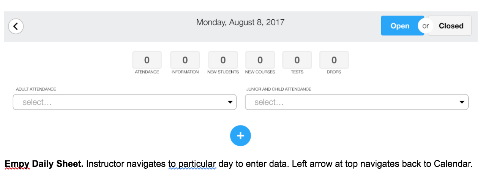

##### School Closed 
On days when the school is closed, the instructor can toggle the school Open / Closed input. Mock-ups shown use Semantic UI toggle. If toggled to closed, the data entry container changes to indicate that the school was closed, as follows:

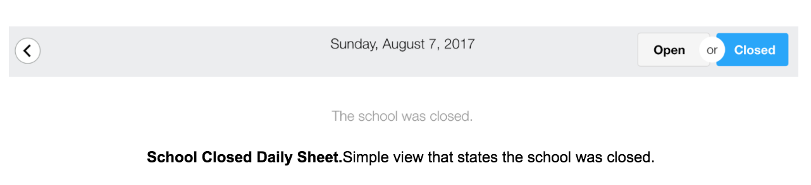

School Closed Event: When an instructor selects the School Closed toggle, we need to write an event into the database that indicates the school was closed. In this way, we can easily track that data was entered, or not entered, for every day for every school.

##### School Open - Attendance
When the school is open, the instructor tracks attendance, and all relevant daily information.

To track attendance, the instructor clicks on a multiple select drop down, and selects every active member of a school (instructor or student) who attended the school on the given day. 

Shown in the mock-up, there are two dropdowns: Adults and Junior / Children. The reason is that seeing a list of both adults and children is more difficult to navigate for an instructor. The proposed mode of providing the active Adults vs Juniors / Children is via a back end table of Active that has a column for student type (Adult, Child, Junior) that is strictly based on age, calculated from a required field of birthday. The reason for this is that the status will change over time, and individual schools may classify certain students one way, and other students another way. We need a national standard for tracking, even if there are minor variations by school. And we need to minimize the amount of upkeep for instructors - thus the calculation of status.

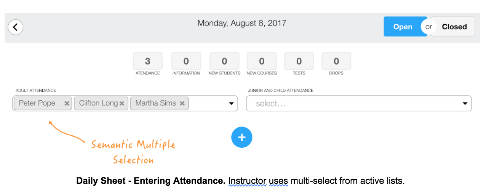

##### School Open - Events
At the core of daily data are the events that we want to capture. All events are on a per-person basis. So for example, if three students test on a given day, this results in three events, one for each student. If two information come in in a given day, it results in two events.

The initial set of events we’ve discussed are as follows:
1. Information - Whenever a school has a prospective student that has reached out in some manner to learn more about training, we track this individual as an information. This is differentiated from a Lead, which is someone who is less likely to train, but that we still want to send messages to, etc. A lead may be someone who signs up to win a free lesson at town event, or someone an instructor bumps into while flyering, whereas an information is someone who took an active effort to reach out the school. We dod not need to capture leads in this app, because most likely the local area will want to enter leads into a correspondence system like intercom.io or mailchimp. At some point in the future, we may wish to add leads and integrate with such systems.  Regarding information, we want to collect basic contact information, age, occupation, etc. and we want to a status: walk-in, contacted. We also want to track source, which would be swalked by, social media, website, flyer, event. 
2. New Student. This occurs when someone signs up and makes a payment. Someone will have to have been an information to reach this stage. Even someone who comes in off the street and immediately signs up is first designated and information then a new student. In this way, selection of anyone who will be a New Student comes from a drop down of Information and Drops, which cover all the use cases for someone signing up.
3.New Course. This occurs when someone signs up for MLT training. We will designate a list of types, which should include: Chung Dan Hyung Championship, Chung Jun Hyung Championship, Full Body Conditioning, Iron Hand Level 1, Bagwa Level 1, Bagwa Level 2, Week End Seminar (1 Day), Week End Seminar (2 Day), Week Long Seminar, Week Long Seminar Partial.  We can also allow for a duration and a description.
3. Test. This occurs when someone tests. Name, rank, pass/fail, as shown in the mock-up.
4. Drop. This occurs when someone drops.
5. New Position. We can considering adding an event for a new position / promotion.

On any given day, any number of events (from 0-n) can be added. Once added and saved, any event can be edited and/or deleted.

We will need to discuss how often the DB is backed up, and where.

##### Adding Events - Flow of UI

An instructor will click the blue plus button to add an event.

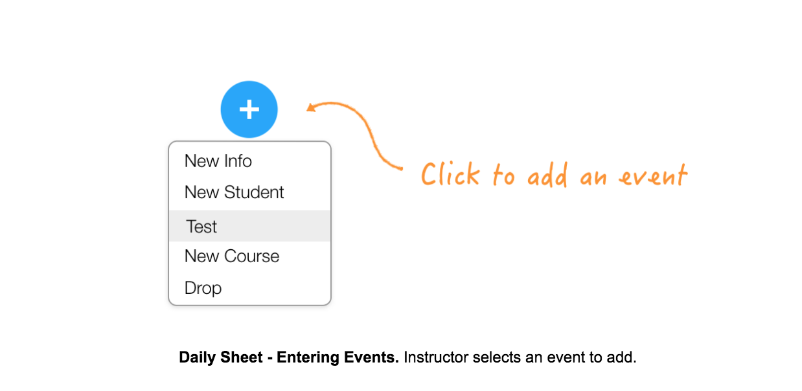

The Container for the Event will appear, which will provide an interface for adding the particular event. The Test container is shown below.

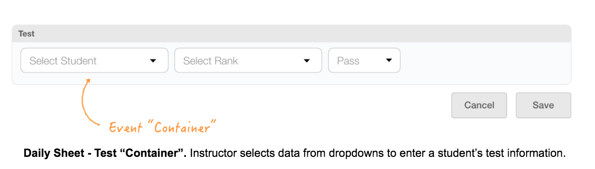

Once any required fields are filled in the container, the Save button will activate.  

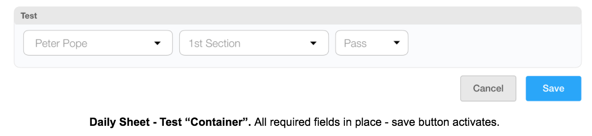

Once saved, the more dots appear, and the event can be edited or deleted. Also, a new blue plus button appears for adding additional events. 

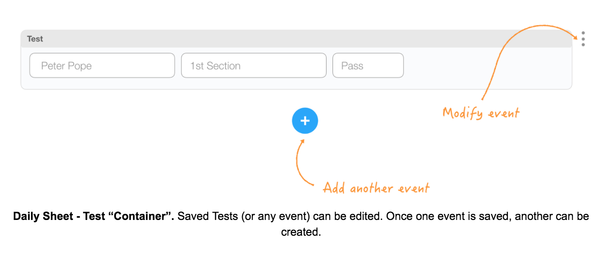

Daily Tally
As each event is added to any given day, the metrics are tallied for review. In the following example, the total attendance for the day was 28, there were 2 infos, 1 new student, and 4 students that tested. 

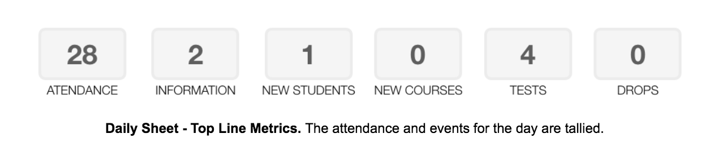

### 2.2. Student Experience
In phase 1, there is no student experience. In the future, we can consider adding features. Some of the most useful may be:
Student tracking own attendance (via a tablet interface in each school that could dovetail into the system)
Prospective students and new students entering their own information (which would again dovetail into the system)
Both of the above feature sets would reduce instructor load on data entry, which would be good to have. However, instructors would still need to validate information such that records are well kept.

### 2.3. Other User Experience
More to come on data and reporting feature set, which will occur within Data Studio and shared out on a school-by-school, region-by-region, and national basis to appropriate stakeholders.

## 3. Data Modeling
For details about data modeling see https://github.com/skapoo01/DailyDataAPI

## 4. MVP Outcome
## results

The MVP is deployed to heroku. See live demo [HERE](https://glacial-lake-93047.herokuapp.com/). You should see the following log in screen.

Request username and password from one of the contributors of this repo.

### 4.1 Features
1. Secure Log In
2. Successfully implements the calendar view where instructors can see the attendance over the month

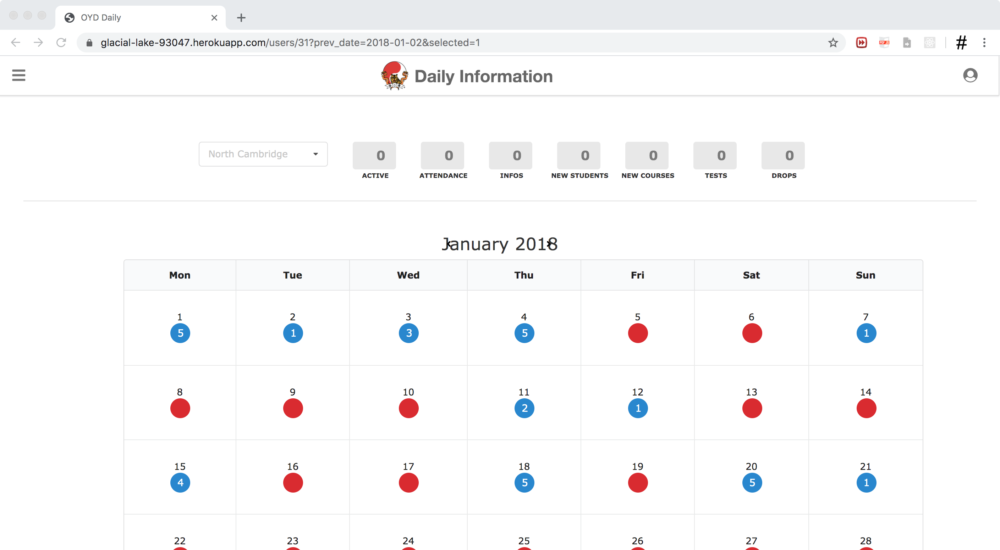

3. Allows instructors to enter Attendance, New Student, New Information and Student Drop data

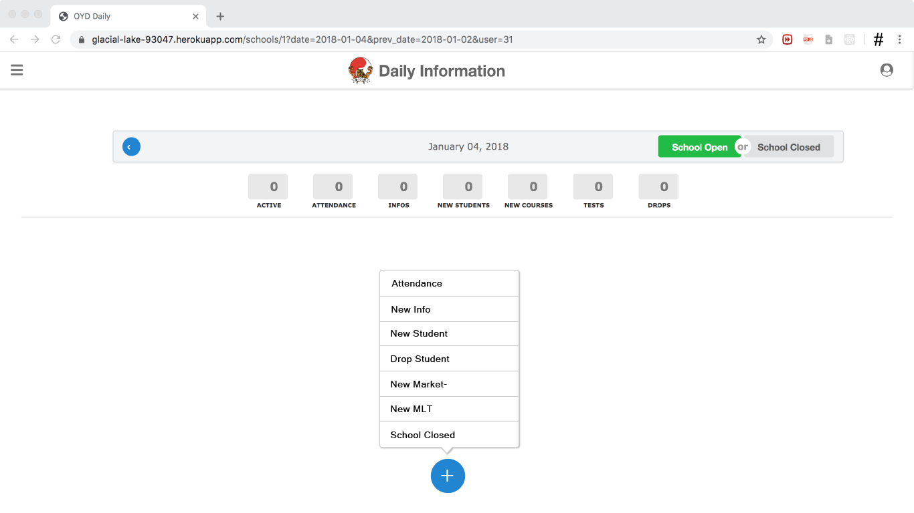

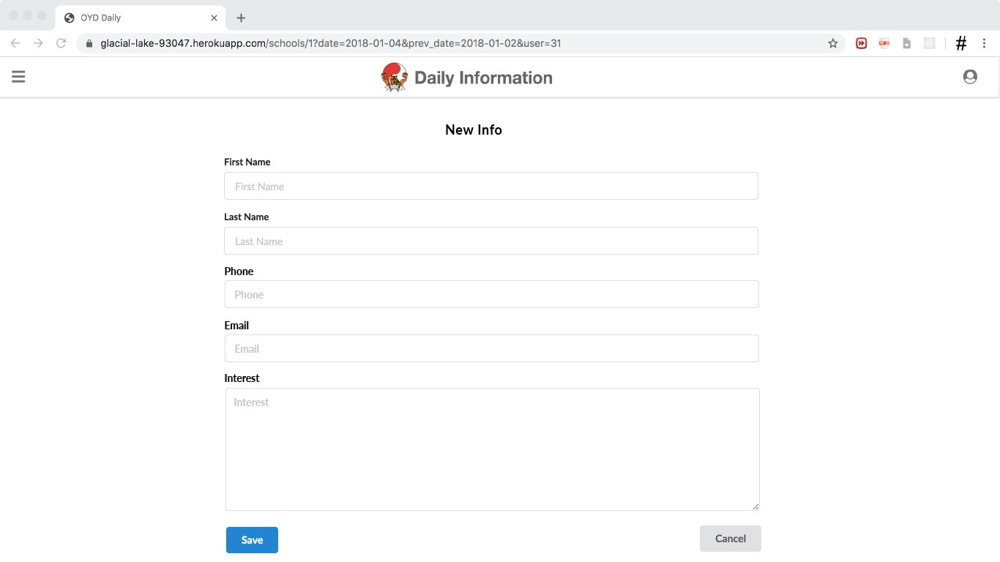

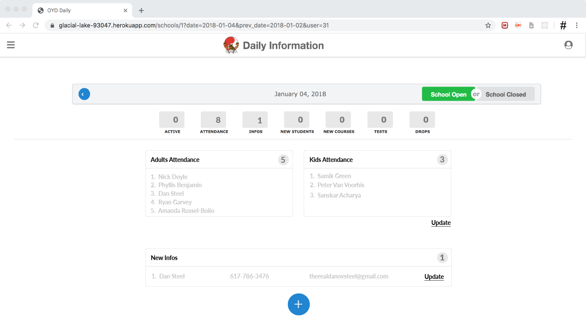

### 4.2 Missing Features
1. Users cannot record all events at this time, for example MLT Events
2. Data analytics is not supported at this time
3. Events are not attached to specific schools and instructors
4. Actual UI does not match specifications

### 4.3 Work To Be Done
1. Add support for remaining events
2. Attach each event to specific schools and instructors
3. Add data analytics support by intergating Google DataStudio reports into the platform
4. Automate report generation on a monthly basis
5. Thorough UX Testing and improvements to make data entry easier
6. Make platform completely mobile responsive - the key clients are martial arts instructors who may or may not have access to laptops, but would likely be using smartphones
7. Create iOS and Android apps using React Native and Web Views